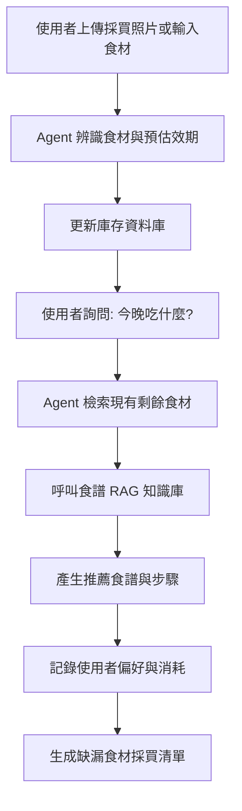

# Smart-Fridge-Manager-
# 期末專題主題提案報告說明

# 1. 專題名稱與一句話說明


## 需要包含

* 專題名稱：AI 冰箱大管家 (AI Kitchen Chef Agent)  
* 系統類型：生活管理與食譜推薦 Agent 系統
* 目標任務：精準管理食材庫存、追蹤過期日，並根據剩餘食材與使用者健康目標進行自動化食譜規劃。
* 使用者可以得到什麼成果：使用者能減少食材浪費、自動產生採買清單，並獲得量身打造的烹飪建議。  較佳範例一句話說明AI 冰箱大管家協助使用者追蹤食材效期、管理庫存，並根據現有材料與健康偏好推薦食譜的智慧廚房助手。


---

# 2. 目標使用者與痛點


| 項目                | 說明                               |
| ------------------- | ---------------------------------- |
| 目標使用者          | 忙碌的上班族、外宿自炊學生、負責家庭採買者                   |
| 使用情境            | 下班回家看著冰箱，不知道能煮什麼。  在超市購物時，不確定家裡還有沒有某樣食材           |
| 痛點                | 食材常放到過期卻不自知，造成浪費。  搜尋食譜時，常發現缺漏關鍵食材。  手動輸入食材資料太過瑣碎，難以持續記帳             |
| 為什麼需要 AI Agent | 系統需具備「決策能力」，能根據剩餘食材、有效期與使用者的健康歷史紀錄，主動判斷哪些食材需要優先處理，而非只是被動的資料顯示 |


```text
目標使用者：
忙碌的上班族、外宿自炊學生、負責家庭採買者。

使用情境：
下班回家看著冰箱，不知道能煮什麼。  在超市購物時，不確定家裡還有沒有某樣食材。

痛點：
1. 食材常放到過期卻不自知，造成浪費。
2. 搜尋食譜時，常發現缺漏關鍵食材。
3. 手動輸入食材資料太過瑣碎，難以持續記帳。

為什麼需要 AI Agent：
系統需具備「決策能力」，能根據剩餘食材、有效期與使用者的健康歷史紀錄，主動判斷哪些食材需要優先處理，而非只是被動的資料顯示。
```

---

# 3. 核心任務流程



---

# 4. Agent 架構設計

本系統採用多模組分工設計：


| 模組 / Agent                   | 任務                       |
| ----------------------- | -------------------------- |
| Inventory Agent      | 管理食材入庫與出庫，追蹤每一項食材的剩餘量   |
| Expiry Agent   | 專門判斷不同類型的食材（如葉菜類 vs. 根莖類）的預估保存期限  |
| Chef Agent (RAG) | 根據現有食材庫存，從知識庫中匹配最適合的食譜  |
|  Memory Agent     | 記錄使用者過敏原（如：不吃海鮮）與歷史點擊偏好 |
| Shopping Agent | 判斷庫存低於臨界值或食譜缺件時，自動整理採買清單 |


---

# 5. RAG / 資料來源設計


| 項目         | 說明                                       |
| ------------ | ------------------------------------------ |
| 食材保存期限表 (CSV)     | 建立各類食物的平均保鮮期對照表  |
|  食譜知識庫 (Markdown/JSON)     | 儲存數百道料理的食材需求、烹飪步驟與營養成分  |
|  使用者偏好文件 | 記錄使用者不喜歡的食材或特定飲食習慣（如：生酮、純素）。  查詢方式：當使用者詢問建議時，Agent 會進行語意檢索，找出最符合現有食材庫存的料理     |
| 查詢方式     | 當使用者詢問建議時，Agent 會進行語意檢索，找出最符合現有食材庫存的料理  |

---

# 6. Tool Calling 設計

## 工具表

| 工具名稱 | 功能 | 輸入 | 輸出 | 觸發時機 |
| -------- | ---- | ---- | ---- | -------- |
| Shelf_Life_Calc   | 計算預計到期日食材類別、購買日期到期日期、狀態食材入庫時     | 食材圖片或自行輸入食材文字 | 預計到期日期、效期狀態|  使用者新增食材或上傳採買照片時|
| Recipe_Matcher   |   篩選符合條件食譜現有食材、忌口清單食譜清單請求晚餐建議時   | 現有食材清單、忌口偏好、即將過期食材|推薦食譜名稱、烹飪步驟、所需食材對照。| 使用者詢問「今晚吃什麼？」或請求烹飪建議時|
| List_Exporter   |  匯出採買清單缺少的食材項目Markdown 格式清單庫存不足或確認食譜    | 缺少的食材項目、現有低庫存清單|Markdown 格式或 PDF 的採買清單|確定烹飪計畫後發現缺料，或使用者要求生成購物清單時。|

---

# 7. 預期畫面與操作方式

提案階段不需完成系統，但需要規劃使用者會如何操作。

至少需準備 3 個畫面草圖或 Wireframe。

## 建議畫面

| **畫面** | **主要功能** | **使用者可做的操作** |
| --- | --- | --- |
| 首頁 任務輸入頁 | 新增食材、上傳照片、設定偏好 | 貼文字、拍照上傳、確認辨識、入庫 |
| Agent 工作頁 | 追蹤判斷流程、人工介入 | 查看步驟、暫停/覆核、修改分量 |
| 結果頁 Dashboard | 顯示推薦、圖表、匯出清單 | 查看食譜、下載清單、更新庫存 |


---

# 8. 期末 Demo 情境設計


```text
使用者會輸入什麼
範例輸入：文字或語音：「我買了高麗菜和豬肉。」或上傳兩張採買照片。

選項：使用者可同時設定偏好（例如：「不吃辣」）或健康目標（低鹽）。

Agent 會做哪些判斷
辨識判斷：從文字/照片抽出食材名稱與數量。

效期判斷：根據食材類別與購買日估算保存期（例如：高麗菜 5 天、豬肉 2 天）。

優先級判斷：結合效期與使用者偏好決定優先處理順序（先處理豬肉）。

配方適配判斷：檢查現有庫存與使用者限制，選出可做且符合健康偏好的食譜。

Agent 會呼叫哪些工具
食材辨識與解析工具（處理照片與文字輸入）

保存期計算器（根據類別與購買日估算到期）

食譜檢索引擎（語意檢索現有食譜知識庫並篩選）

採買清單匯出器（生成缺漏食材清單供使用者下載或複製）

中間狀態如何改變
輸入階段：顯示「辨識中」與辨識結果草稿。

估期階段：每項食材顯示估計到期日與優先等級。

配方匹配階段：列出候選食譜與缺料清單（若缺料則標示）。

確認階段：使用者接受食譜 → 系統扣除庫存並更新紀錄；或使用者要求替代 → Agent 重新篩選。

最後輸出什麼成果
即時回覆（文字）：例如「已入庫，高麗菜預計 5 天後過期，豬肉建議 2 天內煮掉。」

快過期清單：可排序與過濾的列表。

推薦食譜：含步驟、所需食材與營養摘要。

採買清單：缺漏食材的 Markdown 清單或可複製文字。

更新後的庫存紀錄：供後續查詢與分析。

觀眾能看到什麼展示效果
實時流程演示：從首頁輸入 → Agent 工作頁時間軸逐步展開 → Dashboard 顯示最終建議，整個 pipeline 可視化。

重點高亮：Demo 中高亮 Agent 判斷（例如：自動標註「優先處理：豬肉」），並示範人工覆核如何影響結果。

互動操作：示範使用者接受食譜後系統自動扣庫存與產生採買清單，並下載或複製清單。

加速回放：以加速播放方式呈現多步驟處理，讓觀眾在短時間內看到完整閉環。
```


---

# 9. 組員分工

請清楚說明每位組員負責的部分。

## 分工表範例

| 成員 | 負責內容                             |
| ---- | ------------------------------------ |
| 朱覺祥    |負責 Streamlit/Web 介面開發，實作「拍照上傳」與「庫存視覺化清單」的 UI    |
|許瀞云    | 負責資料庫架構 (SQLite) 與 Inventory Agent，實作食材入庫、消耗、數量更新的 CRUD 功能    |
| 林伽紜    | 核心 Chef Agent 的 Prompt 設計與 Tool Calling 框架，串接 LLM 決策邏輯。    |
| 林湘紜    | 負責食譜知識庫建置 (Vector DB) 與 Recipe_Matcher 檢索工具，實作語意搜尋與忌口過濾邏輯    |
| 姚谷伝    | 負責 Expiry Agent 與 Shopping Agent。開發「食材折舊與損耗診斷」功能    |
## 注意事項

分工不能只寫：

```text
大家一起做。
```

需明確說明每位成員負責什麼功能或模組。

---

# 10. 評估方式

請說明期末時要如何判斷這個 Agent 是否做得好。

## 評估面向

| 評估面向       | 說明                             |
| -------------- | -------------------------------- |
| 任務完成率     |Agent 是否能準確從模糊輸入中識別食材並計算日期         |
| 記憶一致性     | Agent 是否能記住使用者「不吃辣」的設定，在食譜推薦中自動過濾掉麻婆豆腐。  展示效果：Demo 時能否流暢展示從「入庫」到「生成食譜」的完整閉環         |
| 展示效果     | Demo 時能否流暢展示從「入庫」到「生成食譜」的完整閉環         |
