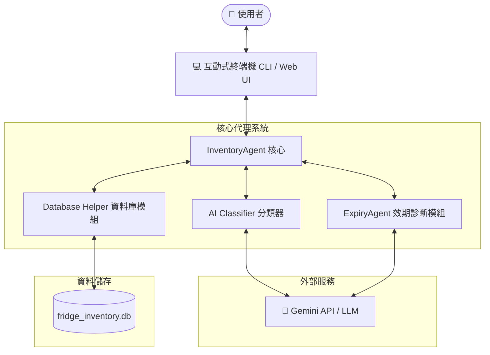
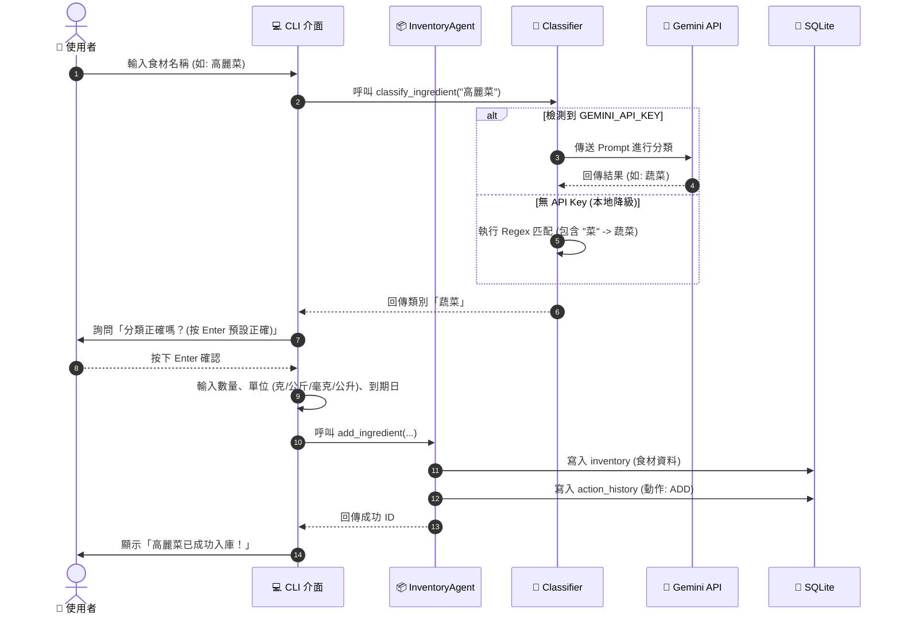
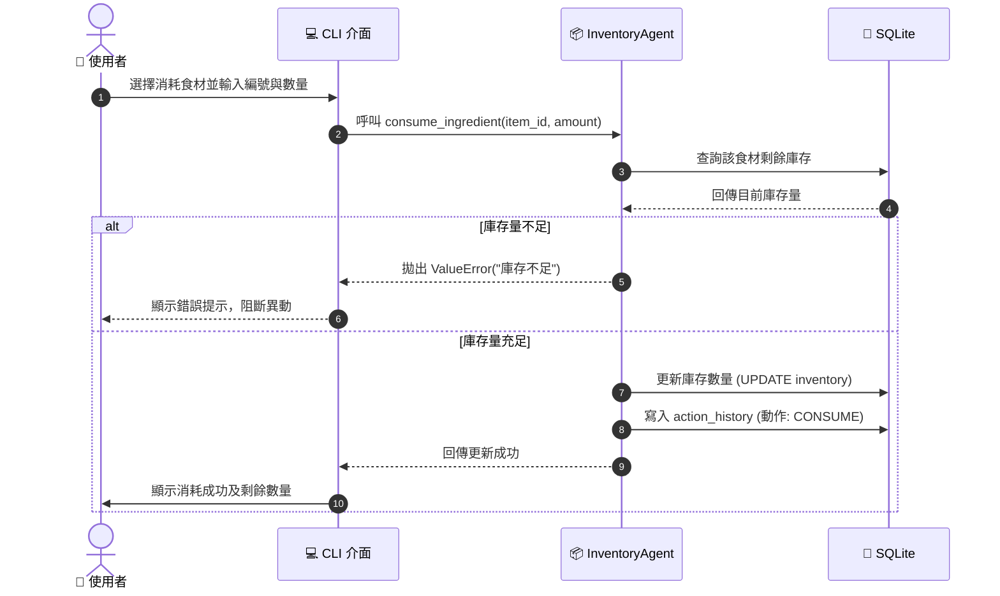
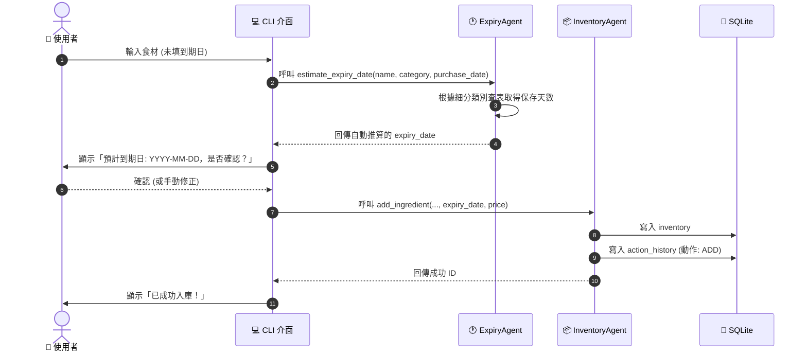

# AI 冰箱大管家 (AI Kitchen Chef Agent) - 系統架構說明書

## 1. 系統架構 (System Architecture)

系統採用輕量化模組設計，基於 Python 與 SQLite 建立庫存管理核心，並透過 AI Classifier 分類器模組介接外部大語言模型（LLM）。Expiry Agent 為新增的獨立診斷模組，負責食材細分類別判定、保存期限估算與金額損耗診斷。



### 模組說明：
1.  **UI 介面層**：以互動式對話對接使用者，支援靈活的輸入驗證（可輸入數字代碼或文字名稱）、按鍵確認（按 Enter 直接確認）、以及預防 Windows 終端機亂碼破版設計。
2.  **InventoryAgent 核心**：控制核心業務邏輯，包含防錯單位查驗、資料操作（新增、讀取、更新、刪除）流程分發。
3.  **AI Classifier 模組**：自動判定輸入食材所屬的分類別（含葉菜類 / 根莖類細分）。若有設定 `GEMINI_API_KEY`，則調用 Gemini 模型；若無，則採用內建 Regex 語意庫進行本地分類，保障系統不崩潰。
4.  **ExpiryAgent 效期診斷模組** *(新增)*：
    *   根據食材分類（葉菜類 vs 根莖類 vs 肉類等）對應預設保存天數，自動推算到期日。
    *   掃描全部庫存，輸出 🔴已過期 / 🟡即將過期 / 🟢新鮮 三段狀態標籤。
    *   結合食材 `price`（單價）欄位，計算當前潛在金額損耗，供使用者決策優先消耗。
5.  **Database 模組**：透過 Context Manager 管理 SQLite 連線，並在資料庫內建立 `inventory`（庫存表，含新增 `price` 欄位）與 `action_history`（歷史異動表）兩張資料表。

---

## 2. 資料流 (Data Flow)

### 2.1 食材入庫與自動分類資料流


### 2.2 食材消耗與歷史紀錄資料流


---

### 2.3 Expiry Agent 效期估算與損耗診斷資料流
```mermaid
sequenceDiagram
    autonumber
    actor User as 👤 使用者
    participant UI as 💻 CLI 介面
    participant Expiry as 🕐 ExpiryAgent
    participant Classifier as 🧠 Classifier
    participant LLM as 🤖 Gemini API
    participant DB as 💾 SQLite

    User->>UI: 觸發效期診斷 (查看快過期食材 / 食材入庫時)
    UI->>Expiry: 呼叫 check_expiry(inventory)
    Expiry->>DB: 查詢所有庫存食材 (含 price 欄位)
    DB-->>Expiry: 回傳食材列表

    loop 對每一項食材進行分析
        Expiry->>Classifier: 呼叫 classify_sub_category(name, category)
        alt 有 GEMINI_API_KEY
            Classifier->>LLM: Prompt 判定細分類別 (葉菜類 / 根莖類 / 其他)
            LLM-->>Classifier: 回傳細分類別
        else 無 API Key (本地降級)
            Classifier->>Classifier: Regex 匹配 (菜/菠/萵 → 葉菜; 蘿蔔/薯/蒜 → 根莖)
        end
        Classifier-->>Expiry: 回傳細分類別結果
        Expiry->>Expiry: 查表取得預設保存天數
        Note over Expiry: 葉菜類 4天 / 根莖類 14天<br/>肉類冷藏 3天 / 冷凍 90天<br/>海鮮冷藏 2天 / 水果 7天 ...
        Expiry->>Expiry: 計算效期狀態與損耗金額
        Note over Expiry: 🔴已過期: 損耗 = 剩餘量 × 單價<br/>🟡即將過期(≤3天): 潛在損耗 = 剩餘量 × 單價<br/>🟢新鮮(>3天): 損耗 = 0
    end

    Expiry-->>UI: 回傳診斷結果 (狀態 / 剩餘天數 / 潛在損耗金額)
    UI->>User: 顯示效期報告與優先消耗建議
```

### 2.4 食材入庫時自動推算到期日資料流


---

## 3. Agent 流程 (Agent Flow)
整個「冰箱大管家」系統規劃由多個協作的子 Agent 組成，分工如下：

1.  **Inventory Agent (已實作)**：專注在庫存的 CRUD、單位控制、與寫入 SQLite 資料庫持久化紀錄。

2.  **Expiry Agent (本次新增)** — 細節如下：
    *   **輸入**：庫存食材清單（`inventory` 資料表全記錄）。
    *   **細分類別判斷**：透過 `classify_sub_category()` 對蔬菜類進行二級分類（葉菜 / 根莖），其餘類別維持原一級分類。
    *   **預設保存天數查表**（`SHELF_LIFE_RULES`）：
        | 細分類別 | 儲存方式 | 預設天數 |
        | --- | --- | --- |
        | 蔬菜 - 葉菜類 | 冷藏 | 4 天 |
        | 蔬菜 - 根莖類/其他 | 冷藏 | 14 天 |
        | 肉類 | 冷藏 | 3 天 |
        | 肉類 | 冷凍 | 90 天 |
        | 海鮮 | 冷藏 | 2 天 |
        | 海鮮 | 冷凍 | 30 天 |
        | 水果 | 冷藏 | 7 天 |
        | 乳製品 | 冷藏 | 7 天 |
        | 冷凍食品/火鍋料 | 冷凍 | 180 天 |
        | 調味料 | 常溫 | 365 天 |
        | 其他 | — | 7 天 |
    *   **效期狀態診斷**：對每一食材計算 `days_remaining = expiry_date - today`，輸出 🔴已過期 / 🟡即將過期（≤3天）/ 🟢新鮮（>3天）三段標籤。
    *   **金額損耗診斷**：結合 `price` 欄位，計算 `potential_loss = quantity × price`，按損耗金額由高到低排序，讓使用者優先處理最貴且最快過期的食材。
    *   **輸出**：每個食材附加 `status`、`days_remaining`、`sub_category`、`default_shelf_days`、`potential_loss` 等診斷欄位。

3.  **Chef Agent (食譜推薦與過濾)**：使用 RAG 結合向量資料庫，以現有庫存食材為基礎，在 Prompt 中載入使用者健康喜好、忌口設定（Memory Agent）來自動產生食譜。

4.  **Shopping Agent (智慧採買)**：分析冰箱內即將用完的佐料、食材，或者針對欲烹飪食譜中所缺少的材料，自動整理出可導出的分組採買清單。

---

## 4. 工具清單 (Tool List)

### 4.1 資料庫與基礎工具
| 工具函數 / 方法名稱 | 所屬模組 | 參數定義 | 描述說明 |
| :--- | :--- | :--- | :--- |
| `init_db()` | `database.py` | 無 | 初始化 SQLite 資料庫，建立 `inventory`（含 `price` 欄位）與 `action_history` 資料表。 |
| `execute_query(query, params, fetch)` | `database.py` | `query` (str), `params` (tuple), `fetch` (bool) | 通用 SQL 執行輔助函數，具備 Context 關閉管理與 Row 映射字典。 |

### 4.2 分類器工具
| 工具函數 / 方法名稱 | 所屬模組 | 參數定義 | 描述說明 |
| :--- | :--- | :--- | :--- |
| `classify_ingredient(name)` | `classifier.py` | `name` (str) | 一級分類：回傳 `蔬菜`/`肉類`/`海鮮` 等主類別；Gemini API 呼叫 + Regex 本地降級。 |
| `classify_sub_category(name, category)` | `classifier.py` | `name` (str), `category` (str) | **新增** 二級細分類：針對蔬菜類判斷 `葉菜類` 或 `根莖類/其他`；支援 AI + Regex 雙軌判定。 |

### 4.3 庫存管理工具 (InventoryAgent)
| 工具函數 / 方法名稱 | 所屬模組 | 參數定義 | 描述說明 |
| :--- | :--- | :--- | :--- |
| `add_ingredient(name, category, ...)` | `inventory_agent.py` | `name`, `category`, `quantity`, `unit`, `purchase_date`, `expiry_date`, `price` | **C**reate 食材入庫，含單位防錯驗證與新增 `price` 欄位支援。 |
| `get_all_inventory()` | `inventory_agent.py` | 無 | **R**ead 取得冰箱現有庫存所有品項（含 `price` 欄位）。 |
| `get_ingredient(item_id)` | `inventory_agent.py` | `item_id` (int) | **R**ead 查詢單一食材詳細屬性。 |
| `update_quantity(item_id, qty)` | `inventory_agent.py` | `item_id` (int), `qty` (float) | **U**pdate 手動調整庫存數量。 |
| `consume_ingredient(item_id, amount)` | `inventory_agent.py` | `item_id` (int), `amount` (float) | **U**pdate 扣減食材消耗，含餘額不足防護機制。 |
| `delete_ingredient(item_id)` | `inventory_agent.py` | `item_id` (int) | **D**elete 丟棄/移除食材。 |
| `get_expiring_ingredients(date)` | `inventory_agent.py` | `date` (str) | 篩選出到期日小於或等於指定日期的快過期食材。 |
| `get_action_history()` | `inventory_agent.py` | 無 | 讀取所有異動紀錄（依據主鍵 `id DESC` 確保精準排序）。 |
| `log_action(type, name, qty, ...)` | `inventory_agent.py` | `type`, `name`, `qty`, `unit`, `details` | 將任何食材的異動日誌存入資料庫以供備查。 |

### 4.4 效期診斷工具 (ExpiryAgent) — 新增
| 工具函數 / 方法名稱 | 所屬模組 | 參數定義 | 描述說明 |
| :--- | :--- | :--- | :--- |
| `estimate_expiry_date(name, category, purchase_date, storage_method)` | `expiry_agent.py` | `name` (str), `category` (str), `purchase_date` (str), `storage_method` (str, 預設 `冷藏`) | 根據食材細分類別查表取得預設保存天數，自動計算並回傳推算到期日 `YYYY-MM-DD`。 |
| `check_expiry(inventory, warning_days)` | `expiry_agent.py` / `tools/shopping_tools.py` | `inventory` (list), `warning_days` (int, 預設 `3`) | 掃描全部庫存，為每一食材附加 `status` (🔴/🟡/🟢)、`days_remaining`、`sub_category`、`potential_loss` 等診斷欄位，並依損耗金額排序輸出。 |
| `get_shelf_life_days(sub_category, storage_method)` | `expiry_agent.py` | `sub_category` (str), `storage_method` (str) | 查詢內建 `SHELF_LIFE_RULES` 字典，回傳對應的預設保存天數 (int)。 |
| `generate_expiry_report(inventory, warning_days)` | `expiry_agent.py` | `inventory` (list), `warning_days` (int) | 整合 `check_expiry` 輸出，按 🔴/🟡/🟢 分組，計算總潛在損耗金額，並格式化為可供 UI 顯示的文字報告或 Markdown。 |
