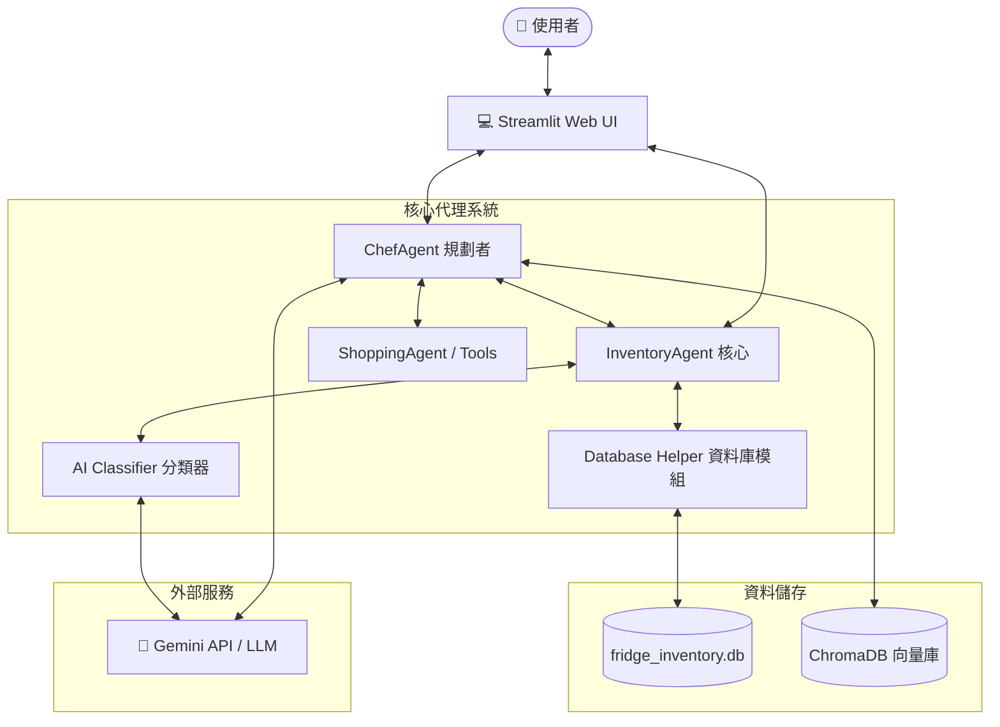
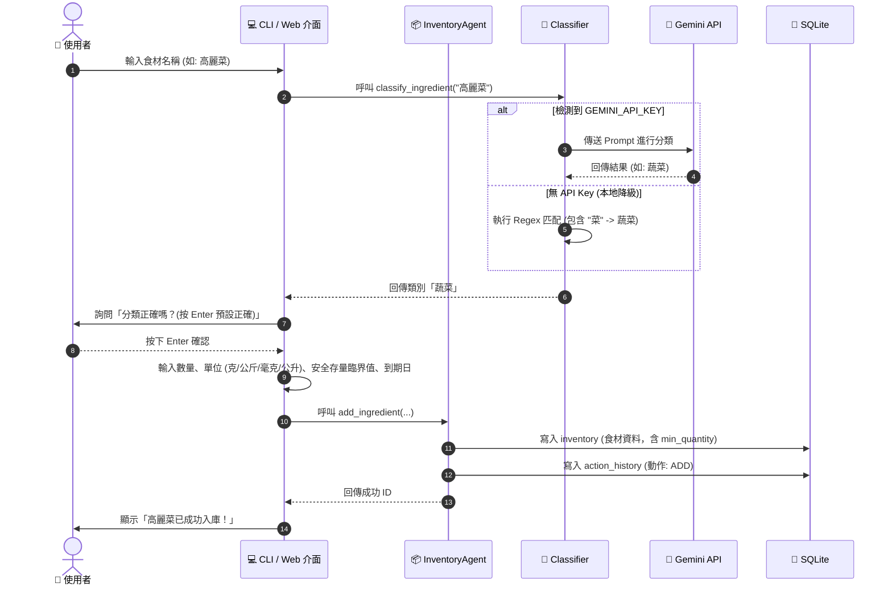
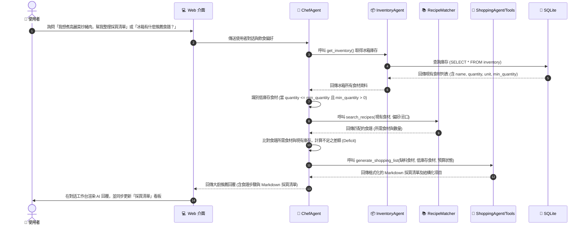
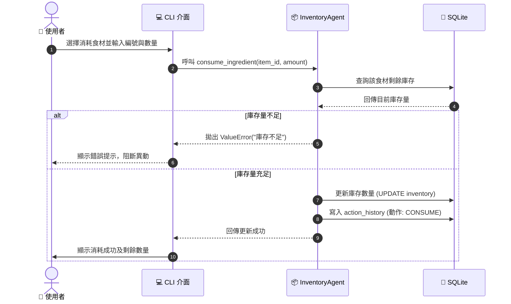

# AI 冰箱大管家 (AI Kitchen Chef Agent) - 系統架構說明書

## 1. 系統架構 (System Architecture)

系統採用輕量化模組設計，基於 Python 與 SQLite 建立庫存管理核心，並透過 AI Classifier 分類器模組介接外部大語言模型（LLM）。同時，結合大廚規劃者（Chef Agent）與智慧採買助理（Shopping Agent），以 ChromaDB 向量庫支援食譜 RAG 檢索，並基於庫存臨界值與食譜缺件生成個人化採買清單。



### 模組說明：
1.  **UI 介面層**：以 Streamlit Web 介面對接使用者，提供庫存監控、快速入庫、偏好設定、以及 AI 對話工作台與執行歷程追蹤 (Tool trace)。
2.  **InventoryAgent 核心**：控制核心業務邏輯，包含防錯單位查驗、安全存量設定、資料操作（新增、讀取、更新、刪除）流程分發。
3.  **AI Classifier 模組**：自動判定輸入食材所屬的分類別。若有設定 `GEMINI_API_KEY`，則調用 Gemini 模型；若無，則採用內建 Regex 語意庫進行本地分類，保障系統不崩潰。
4.  **ChefAgent 規劃者**：作為對話中樞，根據使用者意圖調用庫存查詢、效期診斷、食譜推薦與採買清單生成等工具。
5.  **ShoppingAgent / Tools**：負責比對食譜食材缺件及篩選冰箱中低於安全臨界值 (`min_quantity`) 的食材，結合預算狀態產生個人化採買清單。
6.  **Database 模組**：透過 Context Manager 管理 SQLite 連線，並在資料庫內建立 `inventory`（庫存表，含 `min_quantity` 臨界值欄位）與 `action_history`（歷史異動表）兩張資料表。

---

## 2. 資料流 (Data Flow)

### 2.1 食材入庫與自動分類資料流


### 2.2 食材消耗與歷史紀錄資料流


### 2.3 採買清單與食譜匹配資料流

��/公斤/毫克/公升)、到期日
    UI->>Agent: 呼叫 add_ingredient(...)
    Agent->>DB: 寫入 inventory (食材資料)
    Agent->>DB: 寫入 action_history (動作: ADD)
    Agent-->>UI: 回傳成功 ID
    UI->>User: 顯示「高麗菜已成功入庫！」
```

### 2.2 食材消耗與歷史紀錄資料流


---

## 3. Agent 流程 (Agent Flow)
整個「冰箱大管家」系統規劃由多個協作的子 Agent 組成，分工如下：
1.  **Inventory Agent (本次實作)**：專注在庫存的 CRUD、單位控制、與寫入 SQLite 資料庫持久化紀錄。
2.  **Expiry Agent (預估保存期限)**：根據食材分類（例如葉菜類 vs 根莖類）動態計算不同的預設保存期限，並診斷出高價位快過期的食材，主動警示使用者。
3.  **Chef Agent (食譜推薦與過濾)**：使用 RAG 結合向量資料庫，以現有庫存食材為基礎，在 Prompt 中載入使用者健康喜好、忌口設定（Memory Agent）來自動產生食譜。
4.  **Shopping Agent (智慧採買)**：分析冰箱內即將用完的佐料、食材，或者針對欲烹飪食譜中所缺少的材料，自動整理出可導出的分組採買清單。

---

## 4. 工具清單 (Tool List)

| 工具函數 / 方法名稱 | 所屬模組 | 參數定義 | 描述說明 |
| :--- | :--- | :--- | :--- |
| `init_db()` | `database.py` | 無 | 初始化 SQLite 資料庫，建立 `inventory` 與 `action_history` 資料表。 |
| `execute_query(query, params, fetch)` | `database.py` | `query` (str), `params` (tuple), `fetch` (bool) | 通用 SQL 執行輔助函數，具備 Context 關閉管理與 Row 映射字典。 |
| `classify_ingredient(name)` | `classifier.py` | `name` (str) | 自動分類核心：混合式檢索，支援 Gemini 模型呼叫與 Regex 本地降級庫。 |
| `add_ingredient(name, category, ...)` | `inventory_agent.py` | `name`, `category`, `quantity`, `unit`, `purchase_date`, `expiry_date`, `min_quantity` | **C**reate 食材入庫，含單位防錯與自訂或智慧安全水位警示設定。 |
| `update_min_quantity(item_id, min_qty)` | `inventory_agent.py` | `item_id` (int), `min_qty` (float) | **U**pdate 更新食材的安全存量臨界值。 |
| `get_all_inventory()` | `inventory_agent.py` | 無 | **R**ead 取得冰箱現有庫存所有品項（含 safety threshold 水位資訊）。 |
| `get_ingredient(item_id)` | `inventory_agent.py` | `item_id` (int) | **R**ead 查詢單一食材詳細屬性。 |
| `update_quantity(item_id, qty)` | `inventory_agent.py` | `item_id` (int), `qty` (float) | **U**pdate 手動調整庫存數量。 |
| `consume_ingredient(item_id, amount)` | `inventory_agent.py` | `item_id` (int), `amount` (float) | **U**pdate 扣減食材消耗，含餘額不足防護機制。 |
| `delete_ingredient(item_id)` | `inventory_agent.py` | `item_id` (int) | **D**elete 丟棄/移除食材。 |
| `get_expiring_ingredients(date)` | `inventory_agent.py` | `date` (str) | 篩選出到期日小於或等於指定日期的快過期食材。 |
| `get_action_history()` | `inventory_agent.py` | 無 | 讀取所有異動紀錄（依據主鍵 `id DESC` 確保精準排序）。 |
| `log_action(type, name, qty, ...)` | `inventory_agent.py` | `type`, `name`, `qty`, `unit`, `details` | 將任何食材的異動日誌存入資料庫以供備查。 |

