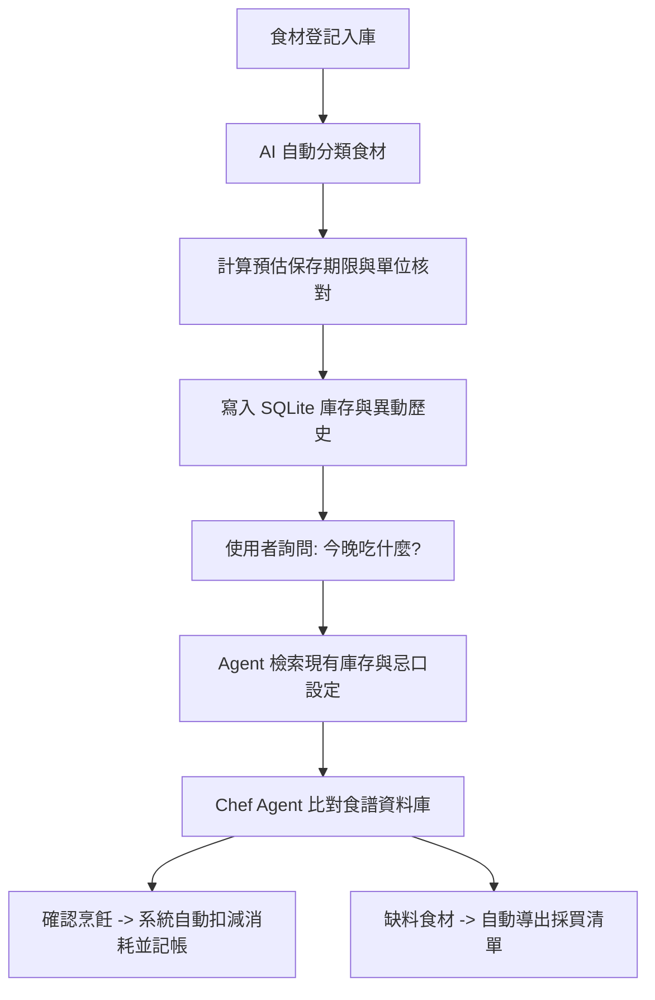

# AI 冰箱大管家 (AI Kitchen Chef Agent) - 產品需求文件 (PRD)

## 1. 專案簡介與目標
**AI 冰箱大管家** 是一個結合「庫存管理」與「智慧食譜推薦」的 Life Assistant Agent 系統。旨在幫助使用者精準掌握冰箱食材狀況、主動提醒效期、減少食材過期浪費，並在不知道煮什麼時，根據現有庫存與使用者健康目標，推薦最適合的食譜及自動整理缺件的採買清單。

---

## 2. 目標使用者與使用者情境

### 2.1 目標使用者
*   **忙碌的上班族**：下班後疲憊，沒有心思思考菜單，且希望縮短烹飪準備時間。
*   **外宿自炊學生**：常因份量難拿捏導致食材放到過期，需要預算控管與剩餘食材最大化利用。
*   **負責家庭採買者**：採買時記不清冰箱裡還有哪些庫存，容易重複購買造成浪費。

### 2.2 使用者情境 (Scenarios)
1.  **情境一：下班疲憊**
    下班回家看著冰箱，不知道該怎麼搭配僅剩的番茄和雞蛋。此時 AI 管家檢索現有食材，推薦「番茄炒蛋」食譜並提供烹飪步驟。
2.  **情境二：超市採買**
    使用者在超市看著特價牛肉，不確定冰箱裡的青椒是否還有。此時開啟管家快速檢視庫存，避免重覆購買。
3.  **情境三：食材到期提醒**
    冰箱裡的豬肉片還有 1 天就到期，AI 冰箱管家發出預警，建議使用者今晚優先將其吃掉，避免食材折舊與金錢浪費。

---

## 3. 核心任務流程 (Core Tasks)

---

## 4. 功能需求 (Functional Requirements)

### 4.1 庫存管理模組 (Inventory Agent - CRUD)
*   **食材入庫 (Create)**：支援食材名稱、類別、數量、單位、購買日及到期日的入庫登記。
    *   *AI 自動分類*：輸入食材名稱後，AI (Gemini) 自動識別其所屬分類並回填，亦保留手動修正機制。
    *   *單位防錯*：僅能輸入 `克`、`公斤`、`毫克`、`公升` 等統一計量單位。若有不符，系統自動攔截並報錯。
*   **查看庫存 (Read)**：列表顯示目前冰箱內所有食材的編號、名稱、類別、剩餘數量及到期日。
*   **消耗食材 (Update - Consume)**：
    *   藉由食材編號進行扣減。
    *   若扣減量大於庫存剩餘量，系統必須阻斷操作並拋出 `ValueError`。
*   **刪除食材 (Delete - 出庫/丟棄)**：當食材完全消耗或損壞時，徹底從庫存中移出。

### 4.2 歷史紀錄與記帳模組 (Action History)
*   **自動化日誌**：每次進行食材 `新增 (ADD)`、`消耗 (CONSUME)`、`調整數量 (UPDATE_QTY)`、`刪除 (DELETE)` 時，系統需自動於資料庫記錄時間戳記、異動內容與變更前後細節。
*   **持久化查詢**：使用者可隨時查閱歷史異動清單，以利追蹤清冰箱進度與消費習慣。

### 4.3 效期評估與診斷模組 (Expiry Agent)
*   **快過期預警**：提供使用者查詢 $N$ 天內即將過期或已過期的食材，並給予分類警示（紅燈已過期、黃燈即將過期）。

### 4.4 智慧食譜與採買模組 (Chef Agent & Shopping Agent) (後續擴充)
*   **語意檢索推薦**：結合 RAG 檢索，以現有庫存為輸入，過濾過敏原與忌口，推薦可製作的料理。
*   **缺料採買建議**：若想做的料理缺件，自動彙整成採買清單導出。

---

## 5. 限制條件與非功能性需求 (Constraints)

*   **計量單位限制**：為確保後續食譜換算及採買單位一致，限定單位只能使用 `克`、`公斤`、`毫克`、`公升`。其他單位（如：顆、瓶、片、包）需在輸入時進行防錯校正。
*   **資料持久化**：使用 SQLite 資料庫 `fridge_inventory.db` 本機儲存，禁止在每次系統重啟時清空資料庫。
*   **本地防崩潰備援**：在 `GEMINI_API_KEY` 未提供或網路異常的情況下，AI 食材自動分類功能需降級為「本機正則表達式語意匹配」，確保系統不中斷。
*   **Windows 終端機相容性**：因應 Windows 主機 CP950 編碼問題，主選單等 UI 字元應避免使用易分離的複合 Emoji 鍵盤字元（如 5️⃣），改用單一 Unicode 帶圈字元（如 ❶）防止顯示破版。
